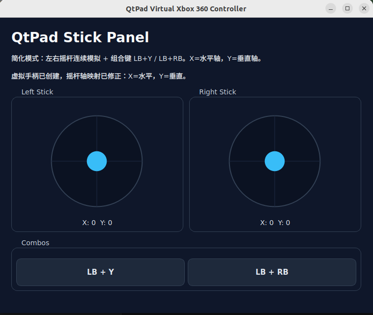

# QtPad

QtPad is a Qt5-based Linux desktop utility that uses `uinput` to create a virtual Xbox 360-style controller. It is designed for simulating stick movement and a small set of combo inputs when you do not have a physical gamepad attached.

## Screenshot



## Features


## Usage


## Build

### Requirements


### Compile

```bash
cmake -S . -B build
cmake --build build
```

## Run

```bash
./build/qtpad
```

## Permissions and Environment

The app needs access to `/dev/uinput`. If it fails at startup, make sure the kernel module is loaded and run it with sufficient permissions.

```bash
sudo modprobe uinput
ls -l /dev/uinput
```

If your distribution does not grant regular users access to `/dev/uinput` by default, you can run it with `sudo` temporarily or add an appropriate `udev` rule.

## GitHub Release Notes


## Audience

This project is a good fit for:


## 中文说明

如果你更习惯中文，也可以把它当作一个 Linux 下的虚拟 Xbox 360 手柄工具：支持左右摇杆圆形拖拽、松手自动回中，以及 `LB + Y`、`LB + RB` 两个组合键。

# QTPAD
